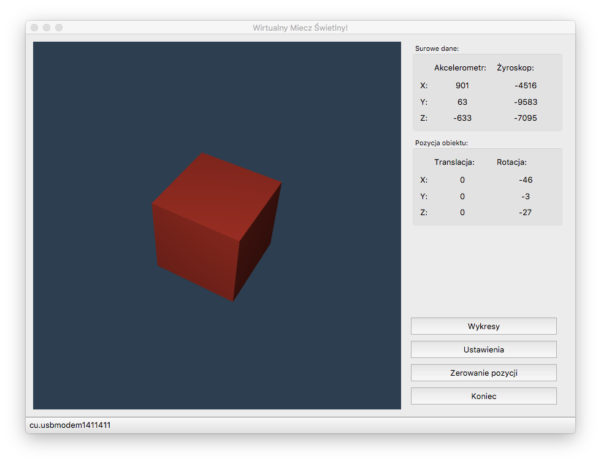
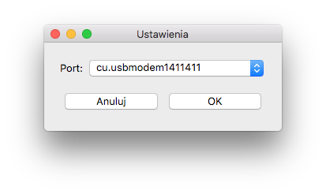
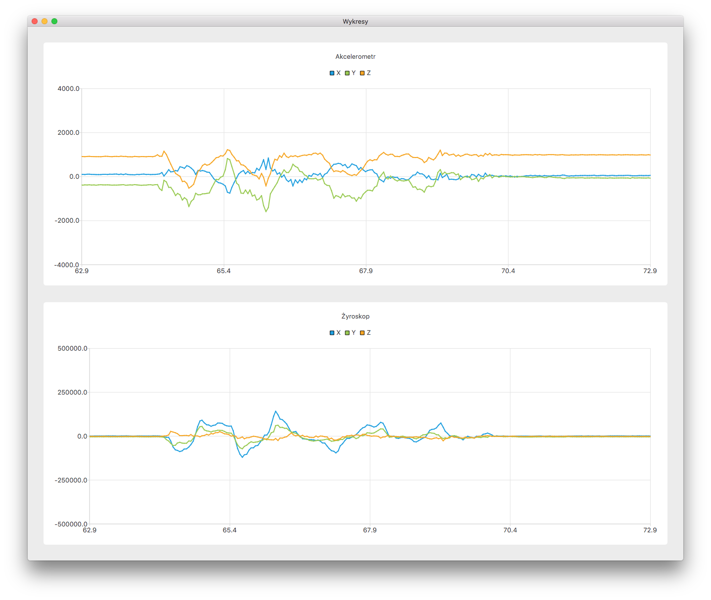

# Virtual Light Saber
App written in Qt for visualizing movement in space by translating and rotating virtual 3D object.
App takes data from accelerometer and gyroscope and animates virtual 3D lightsaber (plain cube for now) with it.
Data is gathered by STM32 from LSM6DS33 Acc+Gyro MEMS with my custom [driver](https://github.com/patrykknapik/lsm6ds33_custom_driver).

TODO:
1. Some kind of filter for rotation
2. Get rid of gravity
3. And calculate translation
4. Light Saber model

*For WDS project on PWR*